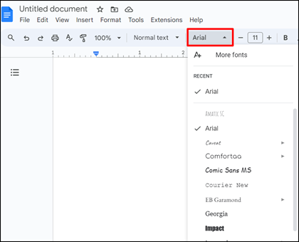

There are many ways to format text in a Google document:

- [Set up the font and font size of text.](#set-up-the-font-and-font-size-of-text)
- [Make text bold, italic, underlined.](#make-text-bold-italic-underlined)
- [Color and highlight text.](#color-and-highlight-text)

To format text, use the icons on the toolbar.

## Set up the font and font size of text

To set up the font of text:

1. On the toolbar, open the dropdown list of fonts.

    

1. Select the necessary font.

To set up the font size of text, on the toolbar:

- Click the  **Decrease font size** icon or the  **Increase font size** icon.

- In the dropdown list, select the necessary font size.

## Make text bold, italic, underlined

To make text bold:

1. Select the text you want to change. 
2. Click the  **Bold** icon.

Alternatively, select the text and press the **Ctrl+B** keyboard shortcut.

To make text italic: 

1. Select the text you want to change. 
2. Click the  **Italic** icon.

Alternatively, select the text and press the **Ctrl+I** keyboard shortcut.

To underline text: 

1. Select the text you want to change.
2. Click the  **Underline** icon.

Alternatively, select the text and press the **Ctrl+U** keyboard shortcut.

## Color and highlight text

To color text:

1. Select the text you want to color.

1. Click the  **Text color** icon.

1. Select the text color.

To highlight text:

1. Select the text you want to highlight.

2. Click the  **Highlight color** icon.

1. Select the highlight color.
